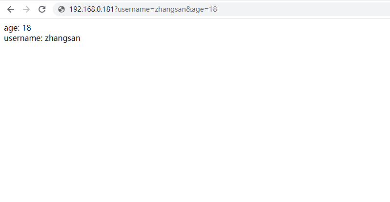
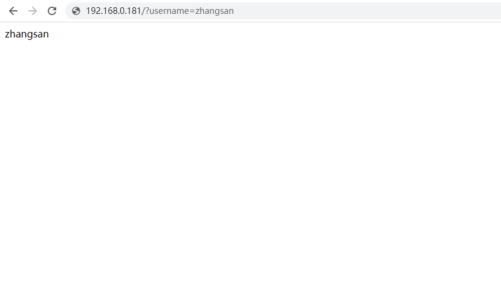
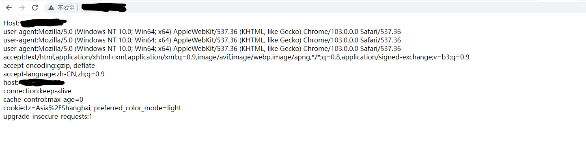
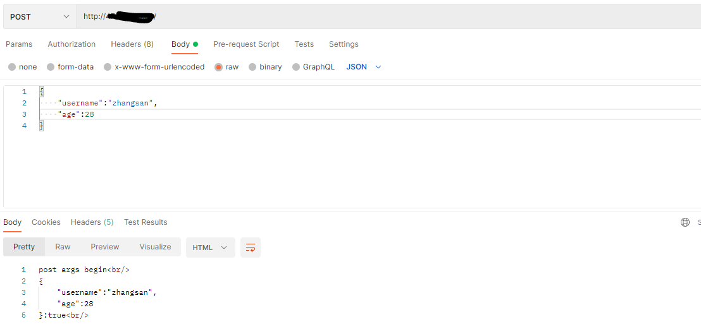
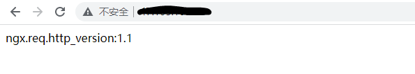
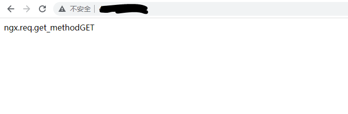
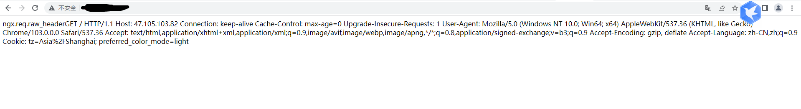
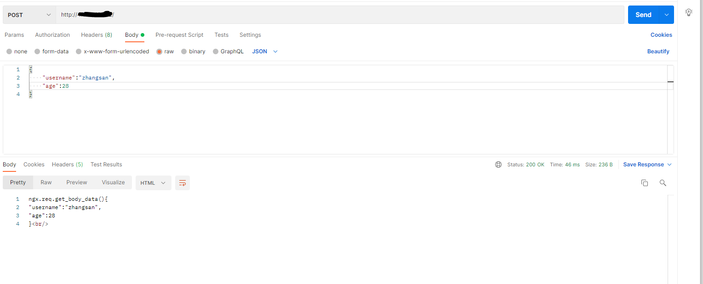

#LUA

## LUA基本的语法

## Lua+Nginx的使用
如果调用的是lua代码块,就可以在laction模块里面进行操作
示例如下:
```shell script
		location / {
			default_type text/html;
			content_by_lua '
			ngx.say("</html><head>this page drived by lua</head><body>this is body..................</body></html>")
			';
		}	
```
执行的效果如下：
[执行lua代码块](./files/execute-lua-block-1.PNG)

如果调用的lua脚本文件，就可以使用用如下的放在在location模块下操作
示例如下:
```shell script
location / {
	default_type text/html;
	content_by_lua_file /usr/local/openresty/lua_codes/resp-1.lua;
}	
# resp-1.lua脚本如下：
ngx.say("</html><head>this page drived by lua</head><body>this is body..................</body></html>")

```
执行的效果如下：
[执行lua代码块](./files/execute-lua-block-1.PNG)


注意: 默认情况下nginx会开启lua脚本缓存，但是脚本的缓存会导致脚本修改后可能无法及时的看到修改后的样子，因为为了调试可以将nginx的lua脚本缓存关闭
在http模块下添加
lua_code_cache off;
启动会提示损害性能

### 获取uri上的请求参数
```shell script
location / {
	default_type text/html;
	content_by_lua_file /usr/local/openresty/lua_codes/resp-1.lua;
}	  
# 获取单个变量
location / {
	default_type text/html;
	content_by_lua_block{
		ngx.say(ngx.var.arg_username)
	}
}
```
resp-1.lua
```lua
    local uri_args = ngx.req.get_uri_args();
    for k,v in pairs(uri_args) do
    		if type(v) =="table" then
    			ngx.say(k, " : ", table.concat(v, ", "), "<br/>")  	
    		else
    		    ngx.say(k, ": ", v, "<br/>") 
    		end
    end	


```
执行结果



* 在处理http请求时还可以使用

set_by_lua
修改nginx变量

rewrite_by_lua
修改uri

access_by_lua
访问控制

header_filter_by_lua
修改响应头

boy_filter_by_lua
修改响应体

log_by_lua
日志


### 获取请求头上的信息
```shell script
location / {
 	default_type text/html;
	content_by_lua_file /usr/local/openresty/lua_codes/resp-1.lua;
}
```
```lua
local headers = ngx.req.get_headers()
ngx.say("Host:",headers["Host"],"<br/>")
ngx.say("user-agent:",headers["User-Agent"],"<br/>")
ngx.say("user-agent:",headers.User-Agent,"<br/>")
for k,v in pairs(headers) do
	if type(v) == "table" then
		ngx.say(k,":",table.concat(v,","),"<br/>")
	else
		ngx.say(k,":",v,"<br/>")	
	end
end
```


### 获取post请求参数
```shell script
location / {
 	default_type text/html;
	content_by_lua_file /usr/local/openresty/lua_codes/resp-1.lua;
}
```
```lua
ngx.req.read_body()
ngx.say("post args begin","<br/>")
local post_args = ngx.req.get_post_args()
for k,v in pairs(post_args) do
	if type(v)=="table" then
		ngx.say(k,":",table,concat(v,", "),"<br/>")
	else
		ngx.say(k,":",v,"<br/>")
	end
end
```


### http协议版本

```lua
ngx.say("ngx.req.http_version : ", ngx.req.http_version(), "<br/>")
```



### 请求方法

```lua
ngx.say("ngx.req.get_method : ", ngx.req.get_method(), "<br/>")  
```

### 原始的请求头内容  

```lua
ngx.say("ngx.req.raw_header : ",  ngx.req.raw_header(), "<br/>")  
```



### body内容体  

```lua
ngx.say("ngx.req.get_body_data() : ", ngx.req.get_body_data(), "<br/>")
```

需要注意的是，如果nginx的功能主要是转发，并不需要对数据进行处理如果需要对数据进行处理，需要在配置文件添加如下配置：
```shell script
#在http模块下添加配置
lua_need_request_body on;
```


