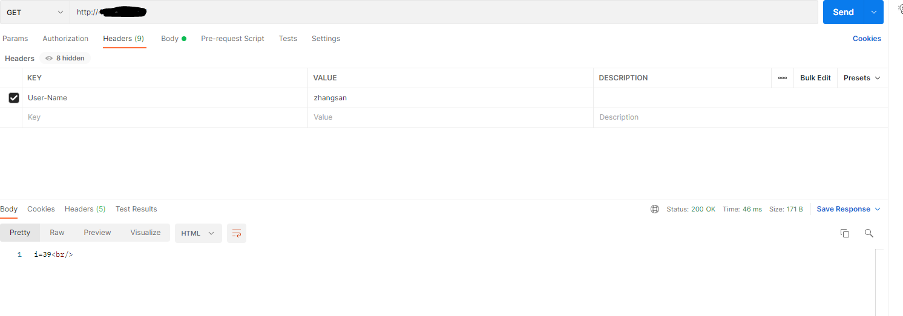
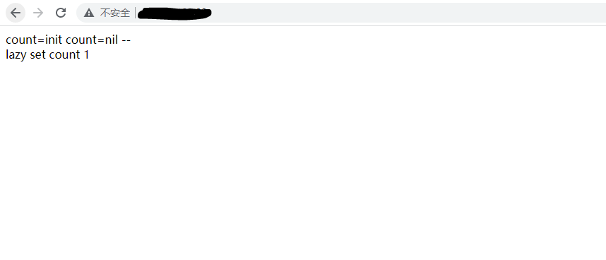
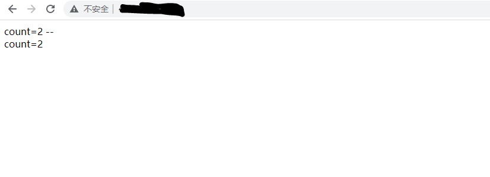
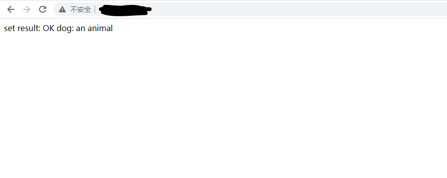
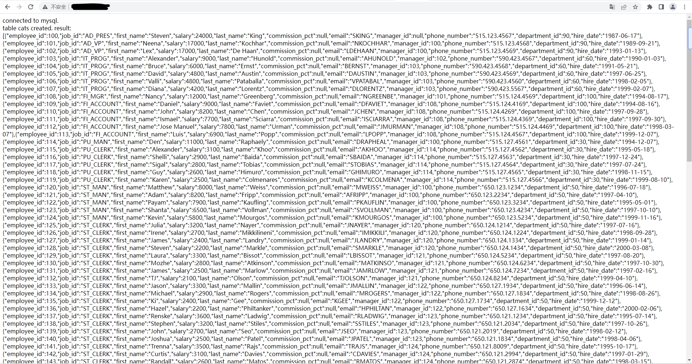

#LUA

## LUA基本的语法

## Lua+Nginx的使用
如果调用的是lua代码块,就可以在laction模块里面进行操作
示例如下:
```shell script
		location / {
			default_type text/html;
			content_by_lua '
			ngx.say("</html><head>this page drived by lua</head><body>this is body..................</body></html>")
			';
		}	
```
执行的效果如下：
[执行lua代码块](./files/execute-lua-block-1.PNG)

如果调用的lua脚本文件，就可以使用用如下的放在在location模块下操作
示例如下:
```shell script
location / {
	default_type text/html;
	content_by_lua_file /usr/local/openresty/lua_codes/resp-1.lua;
}	
# resp-1.lua脚本如下：
ngx.say("</html><head>this page drived by lua</head><body>this is body..................</body></html>")

```
执行的效果如下：
[执行lua代码块](./files/execute-lua-block-1.PNG)


注意: 默认情况下nginx会开启lua脚本缓存，但是脚本的缓存会导致脚本修改后可能无法及时的看到修改后的样子，因为为了调试可以将nginx的lua脚本缓存关闭
在http模块下添加
lua_code_cache off;
启动会提示损害性能

### 获取uri上的请求参数
```shell script
location / {
	default_type text/html;
	content_by_lua_file /usr/local/openresty/lua_codes/resp-1.lua;
}	  
# 获取单个变量
location / {
	default_type text/html;
	content_by_lua_block{
		ngx.say(ngx.var.arg_username)
	}
}
```
resp-1.lua
```lua
    local uri_args = ngx.req.get_uri_args();
    for k,v in pairs(uri_args) do
    		if type(v) =="table" then
    			ngx.say(k, " : ", table.concat(v, ", "), "<br/>")  	
    		else
    		    ngx.say(k, ": ", v, "<br/>") 
    		end
    end	


```
执行结果


* 在处理http请求时还可以使用

set_by_lua
修改nginx变量

rewrite_by_lua
修改uri

access_by_lua
访问控制

header_filter_by_lua
修改响应头

boy_filter_by_lua
修改响应体

log_by_lua
日志


### 获取请求头上的信息
```shell script
location / {
 	default_type text/html;
	content_by_lua_file /usr/local/openresty/lua_codes/resp-1.lua;
}
```
```lua
local headers = ngx.req.get_headers()
ngx.say("Host:",headers["Host"],"<br/>")
ngx.say("user-agent:",headers["User-Agent"],"<br/>")
ngx.say("user-agent:",headers.User-Agent,"<br/>")
for k,v in pairs(headers) do
	if type(v) == "table" then
		ngx.say(k,":",table.concat(v,","),"<br/>")
	else
		ngx.say(k,":",v,"<br/>")	
	end
end
```


### 获取post请求参数
```shell script
location / {
 	default_type text/html;
	content_by_lua_file /usr/local/openresty/lua_codes/resp-1.lua;
}
```
```lua
ngx.req.read_body()
ngx.say("post args begin","<br/>")
local post_args = ngx.req.get_post_args()
for k,v in pairs(post_args) do
	if type(v)=="table" then
		ngx.say(k,":",table,concat(v,", "),"<br/>")
	else
		ngx.say(k,":",v,"<br/>")
	end
end
```


### http协议版本

```lua
ngx.say("ngx.req.http_version : ", ngx.req.http_version(), "<br/>")
```


### 请求方法

```lua
ngx.say("ngx.req.get_method : ", ngx.req.get_method(), "<br/>")  
```

### 原始的请求头内容  

```lua
ngx.say("ngx.req.raw_header : ",  ngx.req.raw_header(), "<br/>")  
```


### body内容体  

```lua
ngx.say("ngx.req.get_body_data() : ", ngx.req.get_body_data(), "<br/>")
```

需要注意的是，如果nginx的功能主要是转发，并不需要对数据进行处理如果需要对数据进行处理，需要在配置文件添加如下配置：
```shell script
#在http模块下添加配置
lua_need_request_body on;
```


## Nginx缓存

### 缓存字典shared_dict
性能高效，可以多个进程共享，但是为了保证数据的一致性，需要加锁

```shell script
local shared_data = ngx.shared.shared_data
local headers = ngx.req.get_headers()
local i = shared_data:get("n")

if not i then 
    i=1;
	shared_data:set("n",i)
	ngx.say("lazy set username",headers["User-Name"]..":"..i,"<br/>")
end
	i = shared_data:incr("n",1);
	ngx.say("i=",i,"<br/>")

```


### lua-resty-lrucache
```shell script
content_by_lua_block {
       require("mycache/mylrucache").go()
   }
```
````lua
local _M = {}
lrucache = require "resty.lrucache"
c, err = lrucache.new(200)  -- allow up to 200 items in the cache
ngx.say("count=init")
if not c then
    error("failed to create the cache: " .. (err or "unknown"))
end
function _M.go()
count = c:get("count")
c:set("count",100)
ngx.say("count=", count, " --<br/>")

if not count then  
    c:set("count",1)
    ngx.say("lazy set count ", c:get("count"), "<br/>")  
else
c:set("count",count+1)
ngx.say("count=", count, "<br/>")
end
end
return _M
````



* 注意
为了能够初始化只在第一次执行，而不是每次请求都需要执行，因此需要将lua_code_cache off;这个配置注释掉


### lua+redis
```shell script
-- 引入openresty的关于redis的依赖
 local redis = require "resty.redis"
    local red = redis:new()
    red:set_timeouts(1000, 1000, 1000) -- 1 sec
local ok, err = red:connect("127.0.0.1", 6379)
-- 连接之后校验密码
 -- ok, err = red:auth("你的密码")
 if not ok then
        ngx.say("failed to connect: ", err)
        return
    end
    ok, err = red:set("dog", "an animal")
if not ok then
      ngx.say("failed to set dog: ", err)
      return
end
ngx.say("set result: ", ok)
local res, err = red:get("dog")
if not res then
    ngx.say("failed to get dog: ", err)
    return
end
if res == ngx.null then
    ngx.say("dog not found.")
    return
end
  ngx.say("dog: ", res)
```



### Nginx+Lua+MySQL

````shell script
location / {
	default_type text/html;
	content_by_lua_file /usr/local/openresty/lua_codes/mysql_store.lua;
}
````
```lua
local mysql = require "resty.mysql"
    local db, err = mysql:new()
    if not db then
        ngx.say("failed to instantiate mysql: ", err)
        return
    end
    db:set_timeout(1000) -- 1 sec
-- 连接数据库
    local ok, err, errcode, sqlstate = db:connect{
        host = "127.0.0.1",
        port = 3306,
        database = "lua_db",
        user = "root",
        password = "root",
        charset = "utf8",
        max_packet_size = 1024 * 1024,
    }
    ngx.say("connected to mysql.<br>")
    local res, err, errcode, sqlstate = db:query("drop table if exists cats")
    if not res then
        ngx.say("bad result: ", err, ": ", errcode, ": ", sqlstate, ".")
        return
    end
    res, err, errcode, sqlstate =
        db:query("create table cats "
                 .. "(id serial primary key, "
                 .. "name varchar(5))")
    if not res then
        ngx.say("bad result: ", err, ": ", errcode, ": ", sqlstate, ".")
        return
    end
    ngx.say("table cats created.")
    res, err, errcode, sqlstate =
        db:query("select * from employees")
    if not res then
        ngx.say("bad result: ", err, ": ", errcode, ": ", sqlstate, ".")
        return
    end
 
    local cjson = require "cjson"
    ngx.say("result: ", cjson.encode(res))
    local ok, err = db:set_keepalive(10000, 100)
    if not ok then
        ngx.say("failed to set keepalive: ", err)
        return
    end
```



